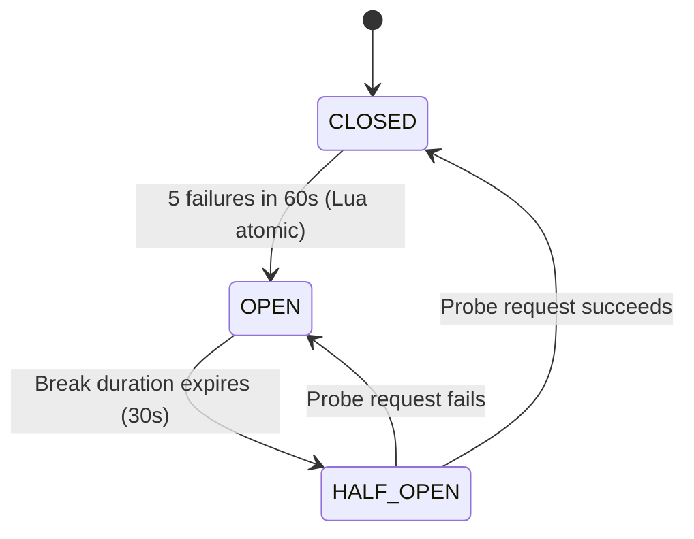
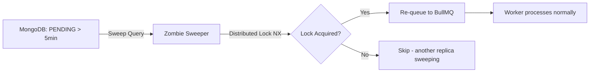

# Webhook Dispatcher

**A production-grade webhook delivery system with at-least-once semantics, circuit breaking, SSRF protection, and AI-assisted dead-letter queue recovery.**

[](https://github.com/yashshinde7610/webhook-dispatcher/actions)


---

## Overview

Webhook Dispatcher solves a core infrastructure challenge: **reliably delivering HTTP callbacks at scale**. Services like Stripe, GitHub, and Shopify all maintain internal webhook dispatchers — this project implements the same patterns used in production at those companies.

**The Problem:** Naive webhook delivery (fire-and-forget HTTP POST) silently drops events when targets are down, networks fail, or services restart mid-delivery. At scale, this causes data loss, broken integrations, and customer-facing outages.

**The Solution:** A durable, queue-backed dispatch pipeline that persists every event to MongoDB before queuing it in Redis/BullMQ, guaranteeing **at-least-once delivery** with exponential backoff retries, circuit breaking for failing endpoints, and a zombie sweeper that recovers events lost during the dual-write window.

### Who Is This For?

- Backend engineers building event-driven architectures
- Teams needing reliable webhook delivery infrastructure
- Developers learning distributed systems patterns (circuit breakers, outbox pattern, idempotency)

---

## Features

### Core Delivery Engine
- **At-Least-Once Delivery** — Events are persisted to MongoDB before queuing, ensuring no data loss on crash
- **Exponential Backoff Retries** — 5 attempts with configurable exponential delays (1s, 2s, 4s, 8s, 16s)
- **Distributed Circuit Breaker** — Lua-scripted atomic state machine (CLOSED → OPEN → HALF_OPEN) prevents cascading failures
- **Zombie Sweeper (Outbox Pattern)** — Background process recovers events stuck in PENDING state due to dual-write failures
- **Idempotent Ingestion** — MongoDB unique sparse index on `idempotencyKey` provides atomic deduplication without Redis RAM pressure

### Security
- **SSRF Protection** — DNS-resolution-based IP validation defeats nip.io aliases, octal encoding, and DNS rebinding attacks
- **DNS-Pinned HTTP Agents** — Axios connections are pinned to the validated IP, preventing TOCTOU attacks
- **HMAC-SHA256 Payload Signing** — Raw-byte signing ensures `HMAC(stored) === HMAC(sent) === HMAC(received)`
- **Constant-Time API Key Comparison** — `crypto.timingSafeEqual` defeats timing side-channel attacks
- **Joi Schema Validation** — All inputs validated before touching the database; blocks NoSQL injection operators
- **PII Redaction** — Sensitive fields (passwords, tokens, emails) are scrubbed from logs and dashboard
- **Non-Root Docker Container** — Runs as `node` user (uid 1000) with least-privilege access

### Real-Time Operations Dashboard
- **Live WebSocket Event Feed** — Real-time delivery status updates via Socket.IO
- **System Health Metrics** — Active workers, queue backlog, dead-letter count, Redis connection state
- **One-Click Replay** — Retry failed/dead events directly from the dashboard
- **AI Suggest-Fix (Gemini)** — Human-in-the-loop dead-letter recovery: AI analyzes failures and suggests payload corrections
- **Batched WebSocket Emission** — Updates are buffered and flushed at intervals to prevent event-loop saturation

### Performance & Scalability
- **50-Concurrent Worker Threads** — BullMQ worker processes up to 50 webhooks simultaneously
- **Redis-Adapted Socket.IO** — Pub/Sub adapter enables horizontal scaling across multiple API replicas
- **Bounded MongoDB Connection Pool** — Configurable `maxPoolSize` prevents connection exhaustion at scale
- **Pino Async Logger** — Structured JSON logging via worker thread; zero event-loop blocking
- **TTL Auto-Purge** — MongoDB TTL index automatically deletes events after 30 days
- **AbortController Timeouts** — Strict 5-second wall-clock timeout defeats tarpit servers

### API Design
- **RESTful Endpoints** — Standard CRUD + replay with proper HTTP semantics (202 Accepted for async operations)
- **Google-Style Field Masks** — `PATCH` updates only explicitly specified fields via `?updateMask=status,url`
- **Redis-Backed Rate Limiting** — Shared counters across replicas (configurable RPM per IP)
- **Pagination** — Cursor-based with `page`, `limit`, `total`, `pages` metadata
- **Trace IDs** — Every request gets a UUID for end-to-end correlation across logs

---

## Tech Stack

| Layer | Technology | Purpose |
|-------|-----------|---------|
| **Runtime** | Node.js 18+ | Server-side JavaScript |
| **Framework** | Express 5 | HTTP API server |
| **Database** | MongoDB (Mongoose 9) | Event persistence, idempotency, state machine |
| **Queue** | Redis + BullMQ | Durable job queue with retry/backoff |
| **Real-Time** | Socket.IO + Redis Adapter | Multi-replica WebSocket broadcasting |
| **Validation** | Joi | Input schema validation |
| **Logging** | Pino + pino-pretty | Structured async logging with PII redaction |
| **AI** | Google Gemini API | Dead-letter queue failure analysis |
| **Auth** | HMAC-SHA256, API Keys | Webhook signing + API authentication |
| **DevOps** | Docker, Docker Compose | Containerized deployment |
| **CI/CD** | GitHub Actions | Automated testing + Docker build verification |

---

## Architecture

<p align="center">
  
</p>

### Request Flow

```
Client → POST /api/events → [Rate Limiter] → [API Key Auth] → [Joi Validation]
    │
    ├─→ MongoDB: Persist Event (status: PENDING)
    │       └─ Idempotency check via unique sparse index (E11000 = duplicate)
    │
    ├─→ Redis/BullMQ: Enqueue job (jobId = MongoDB _id)
    │
    └─→ WebSocket: Emit "Pending" to dashboard (PII-redacted)

Worker picks up job from BullMQ:
    │
    ├─→ Circuit Breaker check (Lua script → CLOSED/OPEN/HALF_OPEN)
    ├─→ DNS Resolution → SSRF IP validation → Pin Agent to validated IP
    ├─→ HMAC-SHA256 sign raw payload bytes
    ├─→ Axios POST to target URL (5s AbortController timeout)
    │
    ├─ Success → recordSuccess() → persistState(COMPLETED) → WebSocket emit
    └─ Failure → classifyError(TRANSIENT/PERMANENT) → recordFailure()
                 → persistState(FAILED/DEAD) → BullMQ retry or give up
```

### Circuit Breaker State Machine



### Zombie Sweeper (Outbox Pattern)



---

## Folder Structure

```
webhook-dispatcher/
├── server.js                    # API entry point: routes, middleware, WebSocket, queue listeners
├── src/
│   ├── worker.js                # Background worker: job processor, SSRF guard, delivery logic
│   ├── circuitBreaker.js        # Distributed circuit breaker with Lua atomicity
│   ├── batchProcessor.js        # Atomic MongoDB state persistence (replaced in-memory buffer)
│   ├── queue.js                 # BullMQ queue configuration with dedicated Redis connection
│   ├── redis.js                 # Shared ioredis client for circuit breaker, rate limiter, sweeper
│   ├── db.js                    # MongoDB connection with bounded pool size
│   ├── models/
│   │   └── Event.js             # Mongoose schema: state machine, TTL index, idempotency index
│   ├── services/
│   │   └── zombieSweeper.js     # Outbox pattern: recovers events lost during dual-write
│   └── utils/
│       ├── logger.js            # Pino async logger with built-in PII redaction paths
│       ├── redact.js            # Deep-clone redaction for dashboard/log display
│       ├── fieldMask.js         # Google-style field mask for safe PATCH operations
│       └── workerUtils.js       # HMAC signing, error classification, HTTP status sanitization
├── public/
│   └── index.html               # Real-time operations dashboard (Socket.IO + Tailwind)
├── tests/
│   ├── fullTest.js              # Comprehensive test suite: ~40 unit + ~25 E2E tests
│   ├── circuitBreaker.test.js   # Circuit breaker unit tests
│   ├── fieldMask.test.js        # Field mask unit tests
│   └── worker.test.js           # Worker utility unit tests
├── .github/workflows/
│   └── ci.yml                   # 3-stage CI: Unit tests → E2E tests → Docker build
├── docker-compose.yml           # Multi-container setup: API + Worker + Redis + MongoDB
├── Dockerfile                   # Production image: node:18-alpine, non-root, npm ci --omit=dev
└── .env.example                 # Environment variable template
```

---

## Installation & Setup

### Prerequisites

- **Node.js** 18+ and **npm**
- **Docker** and **Docker Compose** (recommended) — OR local MongoDB and Redis instances
- **Gemini API Key** (optional — only for AI suggest-fix feature)

### Quick Start (Docker)

```bash
# 1. Clone the repository
git clone https://github.com/yashshinde7610/webhook-dispatcher.git
cd webhook-dispatcher

# 2. Create environment file
cp .env.example .env
# Edit .env and set your secrets (see Environment Variables section)

# 3. Start all services
docker-compose up -d

# 4. Verify
curl http://localhost:3000/  # Should return the dashboard HTML
```

### Local Development (Without Docker)

```bash
# 1. Install dependencies
npm install

# 2. Start MongoDB and Redis locally (or via Docker)
docker run -d -p 27017:27017 mongo:latest
docker run -d -p 6379:6379 redis:alpine

# 3. Create .env file
cp .env.example .env
# Set: API_KEY, WEBHOOK_SECRET, DASHBOARD_TOKEN

# 4. Start the API server
node server.js

# 5. Start the worker (separate terminal)
node src/worker.js

# 6. Open the dashboard
# http://localhost:3000?token=YOUR_DASHBOARD_TOKEN
```

### Running Tests

```bash
npm run test:unit    # Unit tests only (no external services needed)
npm run test:e2e     # E2E tests (requires running API + Worker + Redis + MongoDB)
npm run test:full    # Full suite (unit + E2E)
```

---

## Environment Variables

| Variable | Required | Default | Description |
|----------|----------|---------|-------------|
| `PORT` | No | `3000` | API server port |
| `API_KEY` | **Yes** | — | API authentication key (constant-time compared) |
| `WEBHOOK_SECRET` | **Yes** | — | HMAC-SHA256 signing secret for webhook payloads |
| `DASHBOARD_TOKEN` | **Yes** | — | Read-only dashboard authentication (separate from API_KEY) |
| `MONGO_URI` | No | `mongodb://127.0.0.1:27017/webhook-db` | MongoDB connection string |
| `MONGO_POOL_SIZE` | No | `20` (API) / `55` (Worker) | MongoDB connection pool limit |
| `REDIS_HOST` | No | `127.0.0.1` | Redis hostname |
| `REDIS_PORT` | No | `6379` | Redis port |
| `RATE_LIMIT_RPM` | No | `1000` | Max requests per minute per IP |
| `GEMINI_API_KEY` | No | — | Google Gemini API key for AI suggest-fix feature |
| `GEMINI_MODEL` | No | `gemini-2.0-flash` | Gemini model to use |
| `EVENT_TTL_SECONDS` | No | `2592000` (30 days) | Auto-purge TTL for events |
| `ZOMBIE_THRESHOLD_MS` | No | `300000` (5 min) | Age before a PENDING event is considered a zombie |
| `SWEEP_INTERVAL_MS` | No | `60000` (1 min) | How often the zombie sweeper runs |
| `WS_BATCH_INTERVAL_MS` | No | `500` | WebSocket emission batch interval |
| `LOG_LEVEL` | No | `debug` (dev) / `info` (prod) | Pino log level |

---

## API Documentation

All endpoints require the `x-api-key` header (except `GET /` which serves the dashboard).

### Endpoints

| Method | Endpoint | Description | Status |
|--------|----------|-------------|--------|
| `POST` | `/api/events` | Ingest a new webhook event | `202 Accepted` |
| `GET` | `/api/events` | List events (paginated, filterable) | `200 OK` |
| `GET` | `/api/events/:id` | Get event details | `200 OK` |
| `PATCH` | `/api/events/:id` | Update event fields (field mask required) | `200 OK` |
| `DELETE` | `/api/events/:id` | Delete an event | `200 OK` |
| `POST` | `/api/events/:id/replay` | Replay a failed/dead event | `200 OK` |
| `POST` | `/api/events/:id/suggest-fix` | AI-powered failure analysis | `200 OK` |

### Ingest Event

```bash
curl -X POST http://localhost:3000/api/events \
  -H "Content-Type: application/json" \
  -H "x-api-key: YOUR_API_KEY" \
  -H "Idempotency-Key: unique-key-123" \
  -d '{
    "url": "https://example.com/webhook",
    "payload": { "event": "order.created", "orderId": 42 }
  }'
```

**Response (202):**
```json
{
  "status": "accepted",
  "message": "Job pushed to queue",
  "id": "6839a1b2c3d4e5f6a7b8c9d0",
  "traceId": "a1b2c3d4-e5f6-7890-abcd-ef1234567890"
}
```

### Force Retry (Idempotent Re-delivery)

```bash
curl -X POST http://localhost:3000/api/events \
  -H "x-api-key: YOUR_API_KEY" \
  -H "Idempotency-Key: unique-key-123" \
  -H "x-force-retry: true" \
  -H "Content-Type: application/json" \
  -d '{ "url": "https://example.com/webhook", "payload": { "updated": true } }'
```

### List Events with Filtering

```bash
# Get failed events, page 2
curl "http://localhost:3000/api/events?status=FAILED&page=2&limit=10" \
  -H "x-api-key: YOUR_API_KEY"
```

### PATCH with Field Mask

```bash
curl -X PATCH "http://localhost:3000/api/events/EVENT_ID?updateMask=url,status" \
  -H "x-api-key: YOUR_API_KEY" \
  -H "Content-Type: application/json" \
  -d '{ "url": "https://new-endpoint.com/hook", "status": "PENDING" }'
```

### Error Response Format

All errors include a `traceId` for correlation:

```json
{
  "error": "Bad Request",
  "message": "url must be a valid HTTP/HTTPS URL",
  "code": "VALIDATION_FAILED",
  "traceId": "a1b2c3d4-e5f6-7890-abcd-ef1234567890"
}
```

---

## Security

### Implemented Protections

| Attack Vector | Defense | Implementation |
|---------------|---------|----------------|
| **SSRF** | DNS resolution + IP range validation | `isPrivateIP()` checks RFC-1918, CGN, link-local, loopback ranges |
| **DNS Rebinding** | DNS-pinned HTTP agents | Custom `lookup` function locks Axios to the validated IP |
| **Timing Attacks** | `crypto.timingSafeEqual` | API key comparison always takes constant time |
| **NoSQL Injection** | Joi validation + `stripUnknown` | Rejects `$gt`, `$set`, and other MongoDB operators |
| **Mass Assignment** | Field mask enforcement | PATCH only updates explicitly requested fields |
| **Payload Tampering** | HMAC-SHA256 signatures | Raw-byte signing prevents serialization mismatches |
| **XSS** | `escapeHTML()` in dashboard | All dynamic content is escaped before DOM insertion |
| **OOM** | Request body limit (1MB) | Express `limit: '1mb'` + Axios `maxContentLength` |
| **Tarpit Servers** | AbortController (5s) | Hard wall-clock timeout on entire request lifecycle |
| **Container Escape** | Non-root Docker user | Runs as `node` (uid 1000), not root |

### Known Limitations

- No CORS configuration (dashboard served from same origin)
- No Helmet.js security headers
- `WEBHOOK_SECRET` is global (not per-destination)
- Dashboard stores token in `localStorage` (XSS could steal it)

---

## Testing

### Test Architecture

The project uses a custom test runner with two phases:

| Phase | Tests | Dependencies | Command |
|-------|-------|-------------|---------|
| **Unit** | ~40 tests | None (pure logic) | `npm run test:unit` |
| **E2E** | ~25 tests | Running API + Worker + Redis + MongoDB | `npm run test:e2e` |

### What's Tested

- Circuit breaker state transitions (CLOSED → OPEN → HALF_OPEN → CLOSED)
- Field mask sanitization and edge cases
- HMAC signature generation and error classification
- Event ingestion, idempotency collisions, force retry
- SSRF protection (blocked internal IPs)
- Replay mechanism for failed/dead events
- Rate limiting headers
- Dashboard static file serving
- DELETE and 404 handling
- Cleanup of test data

### CI/CD Pipeline

The GitHub Actions pipeline runs on every push and PR:

```
Stage 1: Unit Tests (Node 18 + Node 20) ──→ Stage 2: E2E Tests (Redis + MongoDB containers)
                                          └→ Stage 3: Docker Build Verification
```

---

## Deployment

### Docker Compose (Development/Staging)

```bash
docker-compose up -d        # Start all 4 containers
docker-compose logs -f api  # Follow API logs
docker-compose logs -f worker  # Follow worker logs
```

### Production Considerations

- Use managed MongoDB (Atlas) and Redis (ElastiCache/Upstash) instead of containerized instances
- Set `NODE_ENV=production` to disable pino-pretty and verbose logging
- Configure `MONGO_POOL_SIZE` based on replica count: `pool = concurrency + 5` per replica
- Add health check endpoints for container orchestrators
- Use secrets management (AWS Secrets Manager, Vault) instead of `.env` files
- Consider horizontal scaling: `docker-compose up --scale api=3 --scale worker=3`

---

## Design Decisions

| Decision | Why |
|----------|-----|
| **Payload stored as String** | Prevents NoSQL injection (`$gt` in keys) and guarantees HMAC consistency — sign once, deliver exact bytes |
| **MongoDB idempotency (not Redis)** | Keys live as long as the event (30 days), not 5 minutes. Survives Redis restarts. Zero RAM pressure. |
| **Lua script for circuit breaker** | Sequential Redis commands (INCR → check → SET) race under 50-concurrency. Lua executes atomically. |
| **No PROCESSING write** | Eliminates 1 MongoDB write per job. BullMQ tracks in-flight state in Redis. Only write on final resolution. |
| **Separate BullMQ Redis connection** | BullMQ uses blocking commands (BLMOVE) that would deadlock the app's non-blocking operations. |
| **Zombie sweeper with distributed lock** | `SET NX` ensures only one replica sweeps at a time, preventing duplicate re-queues across horizontal replicas. |

---

## Contributing

1. Fork the repository
2. Create a feature branch (`git checkout -b feat/your-feature`)
3. Commit your changes with conventional commits (`feat:`, `fix:`, `docs:`)
4. Push and open a Pull Request

---

## License

This project is licensed under the [ISC License](LICENSE).
